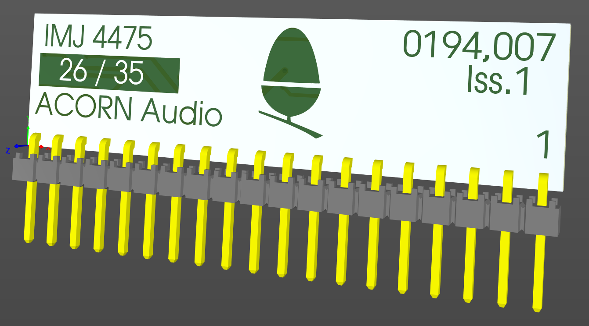
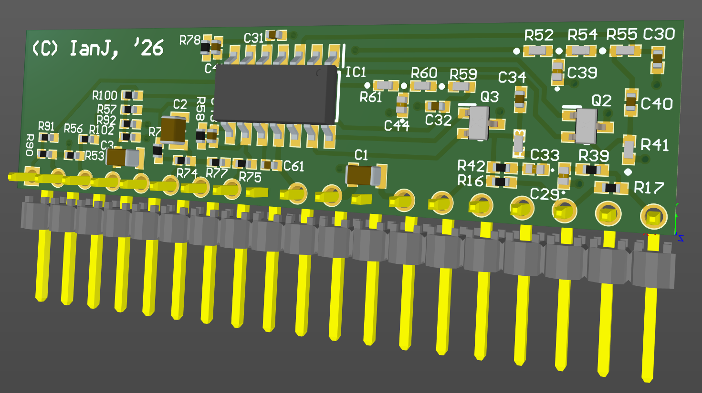

# Acorn Audio Hybrid replacement (for A30x0 / A4000)

August 2026

An implementation of the Acorn 'Audio Hybrid' board for A3010/A3020/A4000,
mostly designed around the detailed near equivalent section of the Acorn A5000 schematic.

This is a work in progress - notionally complete, but not built or tested yet.

## Licence

No warranty is provided, and this work is used at your own risk.  

Licenced as CC BY-SA 4.0

Copyright 2026 Ian Jeffray

